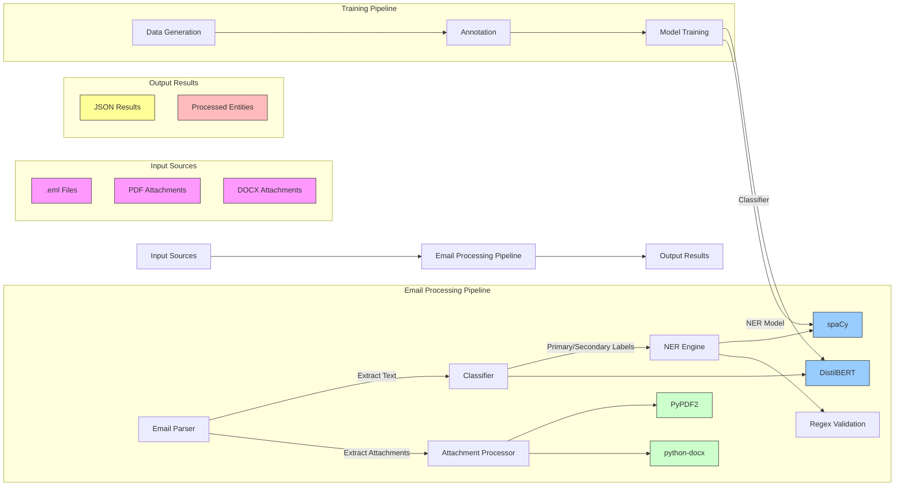

```mermaid
%% Architecture Diagram for Banking Email Processing System
graph LR
    A[Input Sources] --> B[Email Processing Pipeline]
    B --> C[Output Results]
    
    subgraph Input Sources
        A1[.eml Files]:::file
        A2[PDF Attachments]:::file
        A3[DOCX Attachments]:::file
    end

    subgraph Email Processing Pipeline
        B1[Email Parser] -->|Extract Text| B2[Classifier]
        B2 -->|Primary/Secondary Labels| B3[NER Engine]
        B1 -->|Extract Attachments| B4[Attachment Processor]
        
        B2 --> DistilBERT:::model
        B3 --> spaCy:::model
        B3 --> RegexRules[Regex Validation]
        
        B4 --> PyPDF2[PyPDF2]:::lib
        B4 --> python-docx:::lib
    end

    subgraph Output Results
        C1[JSON Results]:::json
        C2[Processed Entities]:::data
    end

    subgraph Training Pipeline
        T1[Data Generation] --> T2[Annotation]
        T2 --> T3[Model Training]
        T3 -->|Classifier| DistilBERT
        T3 -->|NER Model| spaCy
    end

    classDef file fill:#f9f,stroke:#333;
    classDef model fill:#9cf,stroke:#333;
    classDef lib fill:#cfc,stroke:#333;
    classDef json fill:#ff9,stroke:#333;
    classDef data fill:#fbb,stroke:#333;
```
